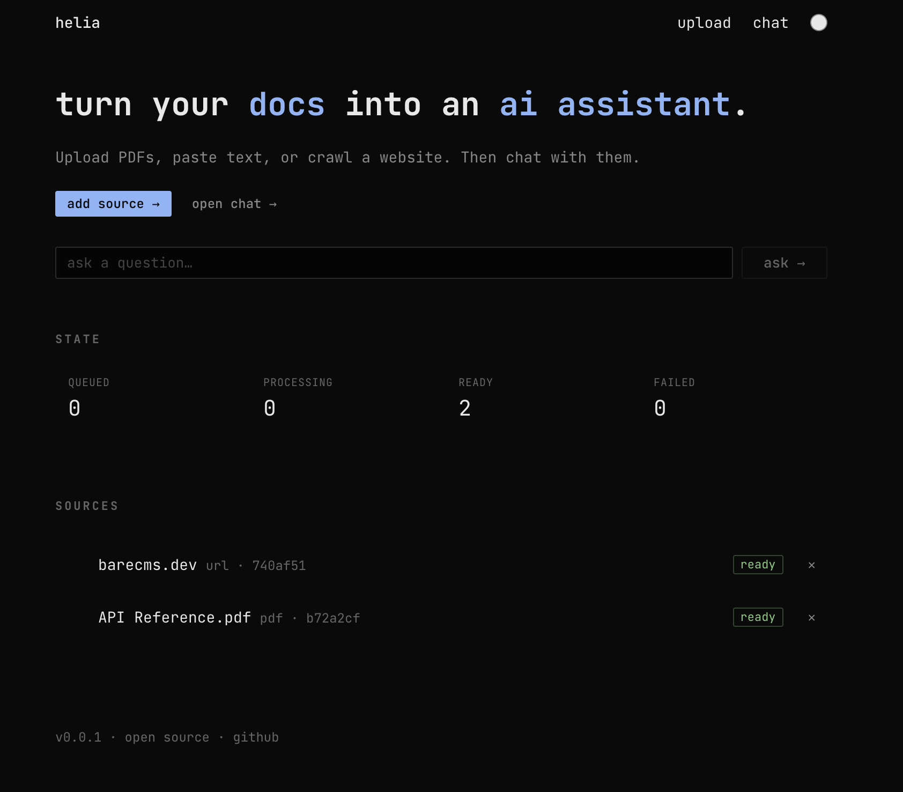
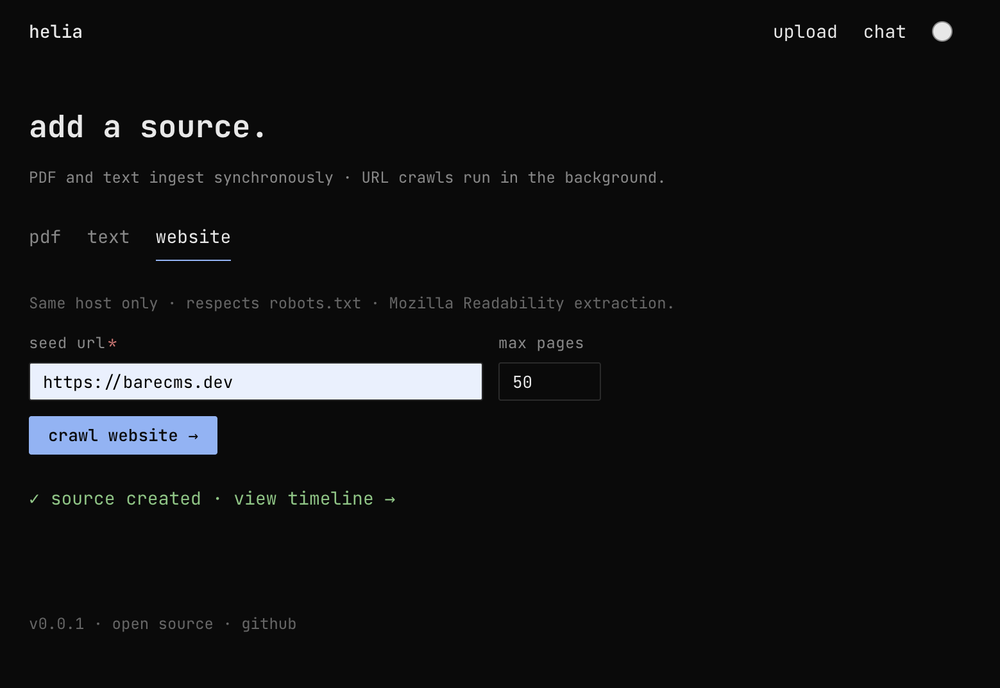
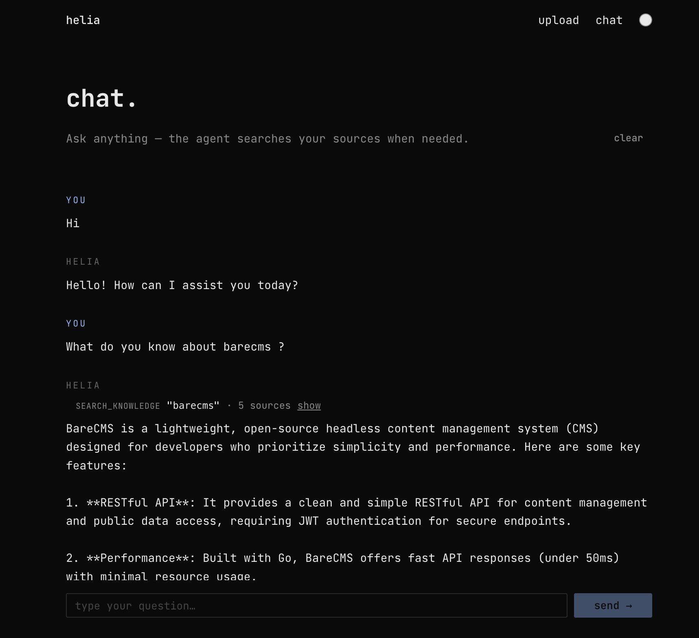

# Helia

> Open-source AI assistant for small businesses. Upload your docs, plug in
> your APIs, drop one script tag.





## Quick start

The same three commands work on your laptop or on any Linux server with
Docker installed. No Node or pnpm needed on the host.

```bash
git clone https://github.com/snowztech/helia
cd helia
cp .env.example .env
```

Open `.env` and fill the two required values:

```bash
OPENAI_API_KEY=sk-...
MASTER_KEY=$(openssl rand -hex 32)
```

Then bring up the stack:

```bash
docker compose up -d
```

First boot takes ~30 seconds. When the api logs say `helia-api listening`,
open **http://localhost:3000** in your browser.

```bash
docker compose logs -f api    # watch boot
docker compose down           # stop, keep data
docker compose down -v        # stop and wipe the database
```

## What you can do

The admin has five pages:

| Page | What it does |
|------|--------------|
| `/` | Dashboard: messages this week, today, avg response, recent activity, getting-started checklist |
| `/sources` | Add knowledge: PDFs, plain text, or crawl a URL |
| `/tools` | Register HTTP endpoints the agent can call mid-conversation |
| `/widget` | Brand the widget, see it live, copy the install snippet |
| `/settings` | Workspace name, locale, model, API key status, allowed origins |

Gear icon (top right) → `/settings`. Theme toggle (top right) → dark/light.

## Embed the widget on your site

Once you've configured the bot, `/widget` shows your install snippet:

```html
<script src="https://your-helia-host/w.js" data-workspace="<uuid>" async></script>
```

Paste it before `</body>` on any page of your site. The widget reads
brand + persona from `/v1/widget/config` on mount, streams chat from
`/v1/chat`, and renders inside a shadow DOM so host page styles cannot
leak in or out.

For embedding while developing Helia itself (port 5173 widget dev
server), see [Develop](#develop).

## Deploy on a server

The `docker compose up -d` above works the same on a VPS. For a real
production deploy with a domain and TLS, you typically add a reverse
proxy (Caddy / nginx / Traefik). Set the public URL in `.env`:

```bash
HELIA_WEB_URL=https://helia.yourdomain.com
HELIA_API_URL=https://helia.yourdomain.com
HELIA_CORS_ORIGIN=https://helia.yourdomain.com,https://app.yourdomain.com
```

Step-by-step deploy + reverse proxy + backups: [`SELF_HOST.md`](./SELF_HOST.md).

## API

| Method | Path | Purpose |
|--------|------|---------|
| `GET` | `/v1/health` | Liveness + DB check |
| `GET` | `/v1/system` | Read-only system info (model, key status, version) |
| `GET` | `/v1/workspace` | Current workspace |
| `PATCH` | `/v1/workspace` | Update name, locale, model, brand, layout |
| `GET` | `/v1/widget/config?ws=…` | Public widget config |
| `POST` | `/v1/chat` | AI SDK data stream (text + tool calls) |
| `GET` | `/v1/metrics` | Counts (today, week, total) + avg latency + tokens |
| `GET` | `/v1/conversations` | Recent chat traces |
| `GET` | `/v1/sources` | List all sources |
| `GET` | `/v1/sources/:id` | Source detail |
| `GET` | `/v1/sources/:id/events` | Ingest timeline |
| `POST` | `/v1/sources/pdf` | Multipart upload, sync ingest |
| `POST` | `/v1/sources/text` | `{ name, text }`, sync ingest |
| `POST` | `/v1/sources/url` | `{ url, maxPages? }`, background crawl |
| `DELETE` | `/v1/sources/:id` | Cascade delete chunks + events |
| `GET` | `/v1/tools` | List workspace HTTP tools |
| `POST` | `/v1/tools` | Create an HTTP tool |
| `PATCH` | `/v1/tools/:id` | Update an HTTP tool |
| `DELETE` | `/v1/tools/:id` | Delete an HTTP tool |

## Architecture

```
apps/
├── api/      # Hono REST + SSE chat (port 4000)
└── web/      # Next.js admin UI (port 3000)
packages/
├── agent/    # generic agent loop (persona + tools + maxSteps), AI SDK based
├── db/       # Drizzle schema + Postgres client
├── rag/      # extract / chunk / embed / retrieve / prompt / crawl / ingest
└── widget/   # vanilla TS embed bundle (~20 KB minified)
```

`apps/api` plugs the agent in `src/agent/tools.ts`. The built-in
`search_knowledge` tool binds `@helia/rag` retrieval to the workspace. On
top of that, any HTTP tools the workspace owner registered (via the
`/tools` admin page) are loaded at chat time. The generic loop in
`@helia/agent` stays app-agnostic.

Full design in [`ARCHITECTURE.md`](./ARCHITECTURE.md). Current sprint
plan in [`V1.md`](./V1.md). Long-arc roadmap in [`ROADMAP.md`](./ROADMAP.md).

**Stack** — Next.js 15 · TypeScript · pnpm workspaces · Hono · Postgres +
pgvector · Drizzle · Vercel AI SDK · OpenAI · shadcn/ui · hugeicons.

## Develop

Hacking on the Helia codebase needs **Node 22+** and **pnpm 9+**. The
database still runs in Docker.

```bash
cp .env.example .env       # if not done yet
make setup                 # postgres + install + schema + bootstrap
make dev                   # api (4000) + admin (3000) + widget (5173) in parallel
```

Useful targets — full list with `make help`:

```
make dev          api + web + widget in parallel
make dev-api      API only
make dev-web      admin only
make dev-widget   widget bundle dev server only
make schema       apply Drizzle migrations
make typecheck    strict TS across the workspace
make docker-up    build + start the full Docker stack (same as Quick start above)
make docker-logs  tail logs from all containers
```

Widget snippet pointing at the local dev bundle + API:

```html
<script
  src="http://localhost:5173/dist/w.js"
  data-workspace="<your-workspace-uuid>"
  data-api-url="http://localhost:4000"
  async
></script>
```

## Contributing

Fork, branch off `main`, `make setup` + `make dev`, open a PR.
`make typecheck` must pass. See [`CONTRIBUTING.md`](./CONTRIBUTING.md).

## License

AGPL-3.0.
